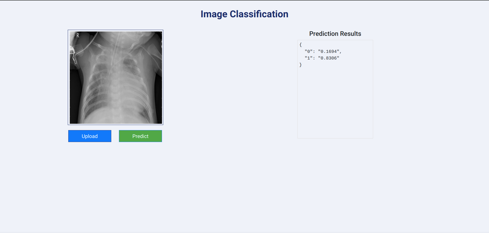
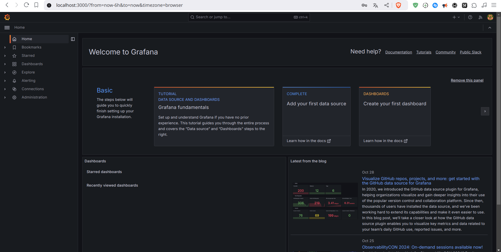

# Intro
An application for predicting pneumonia in a chest X-ray image. It is ready to be deployed to AWS through GitHub Actions:
- DVC for data versioning
- S3 for cloud storage
- MLflow for experiment tracking
- BentoML for inference endpoint
- Prometheus/Grafana for system monitoring
- GitHub Actions for CI/CD
- AWS for deployment infrastructure
# ENV

```bash
conda create -n cnn python=3.9 -y

conda activate cnn

pip install -r requirements.txt

git init

dvc init

python3 setup.py install
```

Data link [link](https://drive.google.com/file/d/1pfIAlurfeqFTbirUZ5v_vapIoGPgRiXY/view?usp=sharing)

# AWS
- Create bucket
- Create iamuser
- Config aws cli

```bash
aws configure
```
If deploy
- Create container registry
- Create virtual server
- Config github action environment variable
# RUN
```bash
bentoml delete image_classifier_service --yes

bentoml models delete model --yes

dvc repro

dvc add artifact/data_ingestion/data
```

# Crate inference endpoint image
```bash
bentoml build

bentoml containerize image_classifier_service:latest -t endpoint
```
# Create client image
```bash
docker build app/client
```

# Create Compse
```bash
docker compose up
```

# Deploy


